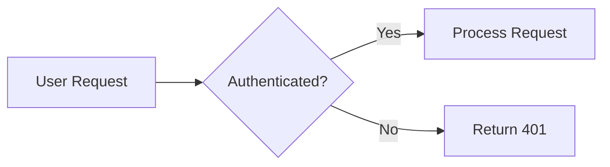

# Mermaid Component Documentation

## Component Description

The Mermaid component renders diagrams from text using Mermaid syntax. It enables visualization of flowcharts, entity-relationship diagrams, sequence diagrams, and other diagram types within React applications and MDX documents.

## Import Statement

```typescript
import { Mermaid } from 'ui'
```

## Props

| Prop | Type | Description |
|------|------|-------------|
| `chart` | `string` | The Mermaid diagram definition |
| `className` | `string` | Optional CSS class for the container |

## Usage Methods

### In MDX Documents

Use fenced code blocks with the `mermaid` language identifier for automatic rendering in blog posts:



### As a React Component

```jsx
import { Mermaid } from 'ui'

export function MyDiagram() {
  return (
    <Mermaid
      chart={`
flowchart LR
    A[User Request] --> B{Authenticated?}
    B -->|Yes| C[Process Request]
    B -->|No| D[Return 401]
`}
    />
  )
}
```

## Supported Diagram Types

### Flowcharts

"Use `flowchart` or `graph` to create flowcharts with nodes and edges. Supports decision diamonds, different node shapes, and directional layouts (TD, LR, etc)."

- Basic flowcharts with conditional branching
- Decision nodes using `{}` syntax
- Subgraphs for grouping related nodes
- Architecture visualization patterns

### ER Diagrams

"Use `erDiagram` to create entity-relationship diagrams showing database schemas. Great for documenting table relationships and foreign keys."

- Simple cardinality relationships
- Column definitions with types and constraints (PK, FK)

### Sequence Diagrams

"Use `sequenceDiagram` to show interactions between participants over time. Ideal for documenting API flows, authentication handshakes, or any request/response patterns."

- Authenticated API request flows
- Asynchronous streaming patterns
- Synchronous blocking patterns

## Resources

Complete syntax reference available in the [Mermaid documentation](https://mermaid.js.org/intro/).
